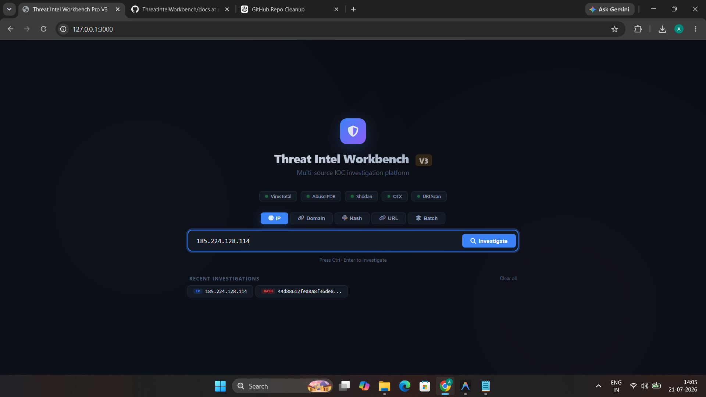
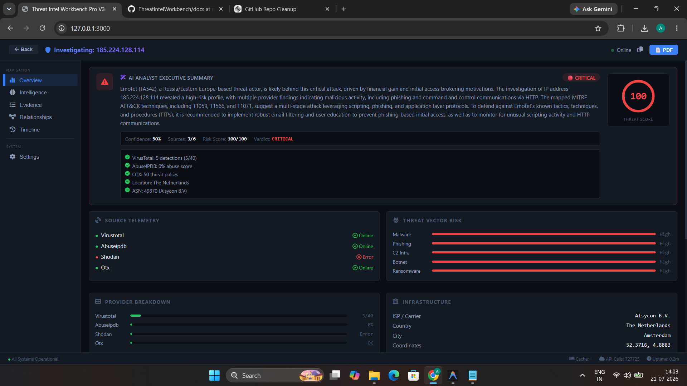
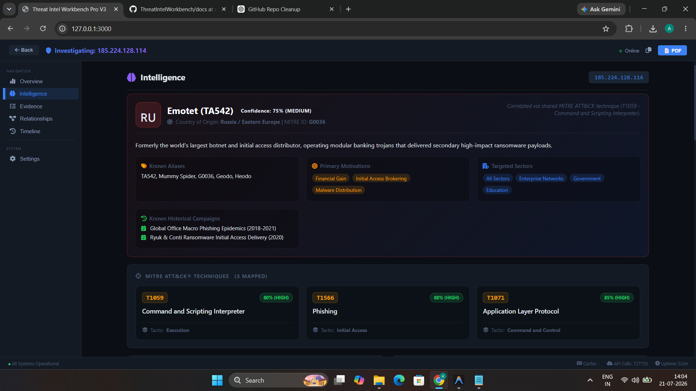
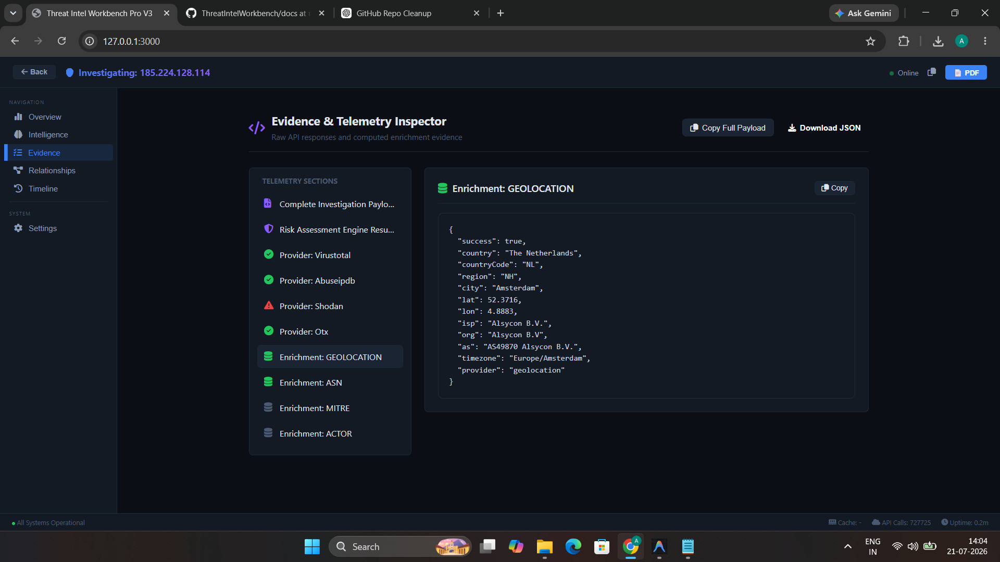
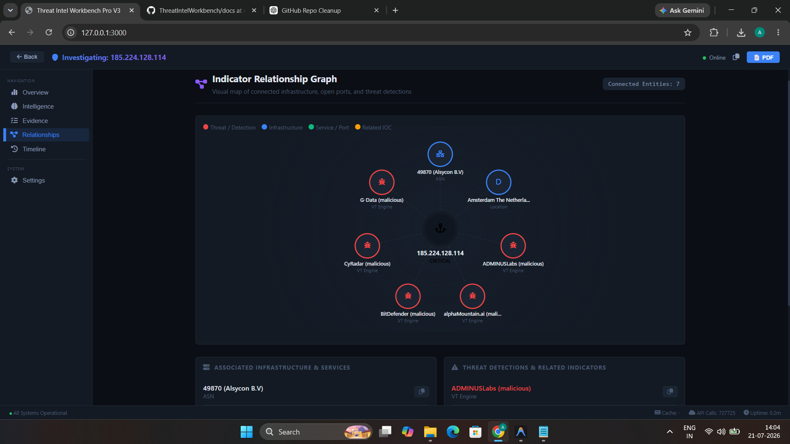
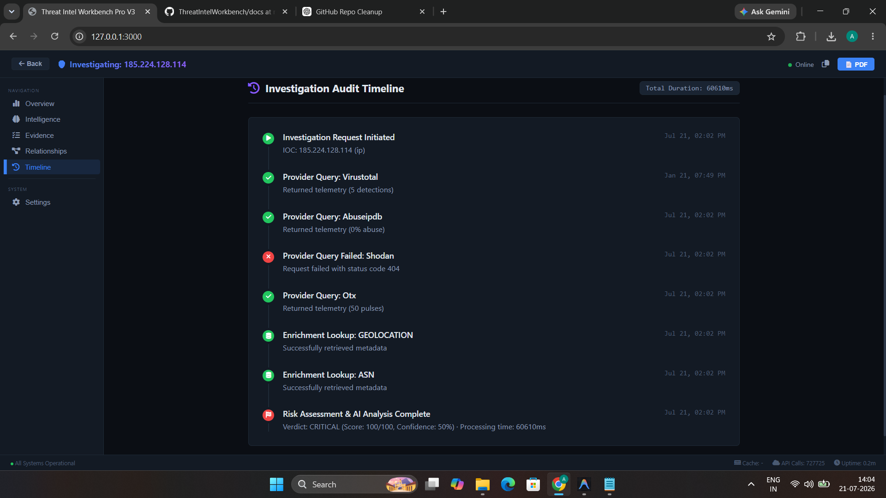

# 🛡️ Threat Intel Workbench Pro V3

[](https://github.com/arunchavan143/demo12)
[](https://nodejs.org/)
[](https://expressjs.com/)
[](https://www.docker.com/)
[](https://attack.mitre.org/)
[](https://groq.com/)

---

## Project Overview

**Threat Intel Workbench Pro V3** is a high-performance, multi-source Security Operations Center (SOC) investigation platform designed for cybersecurity analysts, incident responders, and threat hunters. It correlates real-time telemetry across **15+ integrated threat intelligence feeds**, maps observed behaviors to the **MITRE ATT&CK® STIX 2.1 framework**, attributes threat campaigns to known **Advanced Persistent Threat (APT) profiles**, and synthesizes natural-language executive briefings powered by **Groq AI (`llama-3.3-70b-versatile`)**.

---

## Features

- **🌐 Multi-Source Indicator Investigation**: Seamlessly query IP addresses, domain names, file hashes (MD5/SHA1/SHA256), URLs, and batch indicator lists from a unified, high-contrast dark glassmorphism interface.
- **🧠 AI-Powered Threat Synthesis**: Automatically synthesizes multi-feed telemetry into cohesive natural-language executive summaries, consensus risk evaluations, and actionable containment steps via Groq AI.
- **🎯 MITRE ATT&CK® STIX 2.1 Mapping**: Correlates threat indicators and provider tags directly to documented MITRE tactics and techniques (`T1059`, `T1566`, `T1071`, `T1016`) with confidence badges and interactive mitigation guidance.
- **🕵️ Threat Actor Attribution Engine**: Cross-references IOCs against an O(1) indexed alias database (`700+ aliases`) of major APT groups (`APT29 Cozy Bear`, `Lazarus Group`, `Conti`, `APT28`, `Scattered Spider`, `LockBit`, `Sandworm`, `Emotet`) to expose origin countries, primary motivations, and targeted industries.
- **📊 6 Professional Analyst Tabs**:
  1. **Overview**: AI executive summary, quantitative risk ring (`0-100`), provider status cards, and WHOIS/ASN/Geolocation infrastructure data.
  2. **Intelligence**: APT actor profile header, MITRE technique grid cards, provider breakdown progress bars, harvested IOC tables, observed TTPs, and AlienVault OTX pulse reports.
  3. **Evidence**: Raw JSON payloads across every provider with one-click copy and download for audit preservation.
  4. **Relationships**: Interactive node network graph visualizing structural connections between domains, IPs, and hashes.
  5. **Timeline**: Chronological indicator history tracking initial observation dates, SSL certificate windows, and recent detections.
  6. **Settings**: Real-time API health checks, in-memory TTL cache management with instant purge, and rate limit tracking.
- **📑 Executive Briefing Exports**: One-click generation of cleanly formatted PDF investigation reports, CSV indicator exports suitable for SIEM/SOAR ingestion, and raw JSON evidence bundles.
- **🐳 Enterprise Containerization**: Multi-stage, lightweight Alpine Docker and Docker Compose setup for consistent local execution or production deployment.

---

## Tech Stack

### Frontend
- **HTML5 & CSS3**: Custom Dark Glassmorphism CSS architecture with HSL design variables and responsive CSS Grid/Flex layouts.
- **JavaScript (ES6+)**: Modular, dependency-free vanilla single-page application (SPA) controller with optimized DOM interaction.

### Backend
- **Runtime & Framework**: Node.js 22 LTS, Express.js 4 RESTful API Gateway.
- **Security & Middleware**: Helmet (Security Headers), CORS, Express-Rate-Limit, Joi Schema & Regex Input Validation.
- **Caching**: Node-Cache in-memory Time-To-Live (TTL) store with automatic purge.

### Threat Intelligence APIs
- **VirusTotal API v3**: File detections, vendor categories, domain infrastructure, and passive DNS records.
- **AbuseIPDB API v2**: IP confidence scoring, abuse incident reports, and ISP ownership.
- **Shodan Host API**: Open network ports, service banners, operating systems, and CVE vulnerabilities.
- **AlienVault OTX API**: Threat pulses, adversary tags, MITRE IDs, and related indicator lists.
- **URLScan.io API**: DOM analysis, screenshot records, and phishing classifications.

### AI Components
- **Groq SDK**: Large Language Model API (`llama-3.3-70b-versatile`) with specialized SOC analyst prompt engineering.

### Docker
- **Multi-stage Build**: Alpine Linux containerization separating dependency build stages from runtime deployment.

---

## Architecture

Threat Intel Workbench Pro operates on a decoupled REST API gateway and modular presentation architecture. The backend leverages `Promise.allSettled()` to query upstream intelligence feeds concurrently, ensuring graceful degradation if individual feeds experience timeouts or rate limits. Normalized telemetry is processed through a quantitative risk calculator, correlated against MITRE STIX 2.1 and Threat Actor indices, and passed to Groq AI for briefing synthesis.

For a comprehensive technical dive including data flow sequence diagrams, security controls, and component breakdowns, read our detailed architecture document:

👉 **[System Architecture Documentation (`docs/ARCHITECTURE.md`)](docs/ARCHITECTURE.md)**

---

## Application Preview

### Home & Search Dashboard


### Overview & AI Executive Briefing


### Threat Intelligence & Actor Attribution


### Evidence & Raw JSON Inspection


### Infrastructure Relationship Graph


### Historical Investigation Timeline


---

## Installation

### Prerequisites
- **Node.js**: v18.x or v22.x LTS
- **npm**: v9.x or higher
- **Docker & Docker Compose** *(Optional for containerized run)*

### Option 1: Local Installation

1. **Clone the repository**:
   ```bash
   git clone https://github.com/arunchavan143/demo12.git
   cd threat-intel-workbench
   ```

2. **Install dependencies**:
   ```bash
   npm install
   ```

3. **Configure environment variables**:
   Copy the `.env.example` template to `.env` and insert your upstream API keys:
   ```bash
   cp .env.example .env
   ```
   ```env
   PORT=3000
   GROQ_API_KEY=your_groq_api_key_here
   VIRUSTOTAL_API_KEY=your_virustotal_api_key_here
   ABUSEIPDB_API_KEY=your_abuseipdb_api_key_here
   SHODAN_API_KEY=your_shodan_api_key_here
   OTX_API_KEY=your_alienvault_otx_api_key_here
   URLSCAN_API_KEY=your_urlscan_api_key_here
   ```

4. **Start the development server**:
   ```bash
   npm run dev
   ```

5. **Access the platform**:
   Open `http://localhost:3000` in your browser.

---

### Option 2: Docker Deployment

1. Ensure your `.env` file is present and populated in the root directory.
2. Build and launch using Docker Compose:
   ```bash
   docker-compose up --build -d
   ```
3. Check container logs:
   ```bash
   docker-compose logs -f app
   ```
4. Open `http://localhost:3000` in your browser.

To gracefully shut down the container:
```bash
docker-compose down
```

---

## Folder Structure

```text
threat-intel-workbench-backend/
├── Dockerfile               # Multi-stage production Alpine build
├── docker-compose.yml       # Container orchestration & volume mapping
├── .dockerignore            # Build context exclusions
├── .env.example             # Template for API keys and configuration
├── package.json             # Project dependencies and script definitions
├── README.md                # Project overview and portfolio documentation
├── docs/
│   ├── ARCHITECTURE.md      # Detailed system architecture specification
│   ├── API.md               # REST API endpoints and payload examples
│   ├── USER_GUIDE.md        # Comprehensive analyst operational manual
│   └── screenshots/         # Embedded application previews
│       ├── home.png
│       ├── overview.png
│       ├── intelligence.png
│       ├── evidence.png
│       ├── relationship.png
│       └── timeline.png
├── frontend/                # Client-Side SPA Presentation Layer
│   ├── index.html           # Single-page application shell
│   ├── css/
│   │   └── style.css        # Dark glassmorphism theme and CSS Grid styles
│   └── js/
│       ├── app.js           # Core initialization and event binding
│       ├── api.js           # Axios HTTP client encapsulating backend routes
│       ├── ui.js            # UI DOM controllers and status indicators
│       ├── utils.js         # Security escaping (`safeString`) and helpers
│       └── tabs/
│           ├── intelligence.js  # Threat Actor, MITRE, Provider, and IOC UI renderer
│           ├── evidence.js      # Raw JSON inspector and clipboard utilities
│           ├── relationships.js # Interactive network visualization graph
│           └── export.js        # Executive PDF report and CSV generation
└── src/                     # Node.js / Express Backend Layer
    ├── app.js               # Express application setup and middleware setup
    ├── middleware/
    │   ├── error-handler.js # Centralized JSON error dispatcher
    │   └── validator.js     # Joi validation schemas and regular expressions
    ├── routes/
    │   ├── investigate.routes.js # /api/investigate endpoints (IP/Domain/Hash/URL/Batch)
    │   └── export.routes.js      # Export utility routes
    ├── services/
    │   ├── actor.service.js      # O(1) Threat Actor APT profile index & correlation
    │   ├── mitre.service.js      # MITRE ATT&CK STIX 2.1 mapping database
    │   ├── groq.service.js       # Groq AI LLM (`llama-3.3-70b-versatile`) integration
    │   ├── virustotal.service.js # VirusTotal API v3 integration
    │   ├── abuseipdb.service.js  # AbuseIPDB API v2 integration
    │   ├── otx.service.js        # AlienVault OTX indicator and pulse integration
    │   ├── shodan.service.js     # Shodan open port and banner integration
    │   ├── urlscan.service.js    # URLScan domain/url telemetry integration
    │   └── cache.service.js      # Node-Cache in-memory TTL controller
    └── utils/
        └── risk-calculator.js    # Quantitative risk scoring and verdict engine
```

---

## Documentation

- 📖 **[User Guide (`docs/USER_GUIDE.md`)](docs/USER_GUIDE.md)**: Operational manual covering investigation workflows, tab breakdowns, and export procedures.
- ⚙️ **[API Reference (`docs/API.md`)](docs/API.md)**: Complete REST API documentation including endpoint paths, parameters, and JSON schemas.
- 🏗️ **[System Architecture (`docs/ARCHITECTURE.md`)](docs/ARCHITECTURE.md)**: Comprehensive technical specification detailing Mermaid flowcharts, multi-feed concurrency, and security defense layers.

---

## Roadmap

- **Persistent Historical Storage**: Integrate PostgreSQL/SQLite database support to retain historical investigation records and enable long-term trend analysis.
- **WebSocket Progress Streaming**: Add real-time Server-Sent Events (SSE) or WebSocket streaming for large batch queries (`/api/investigate/batch`), pushing results incrementally to the UI.
- **Automated TAXII 2.1 Ingestion**: Add a background worker module to automatically ingest and index live STIX/TAXII 2.1 threat feeds from global CERTs.
- **Role-Based Access Control (RBAC)**: Support multi-tenant enterprise SOC teams by implementing JWT authentication and tiered analyst roles.

---

## Author

Designed and engineered for professional SOC analysts and defensive cybersecurity engineers.
**Arun Chavan** (`@arunchavan143`)