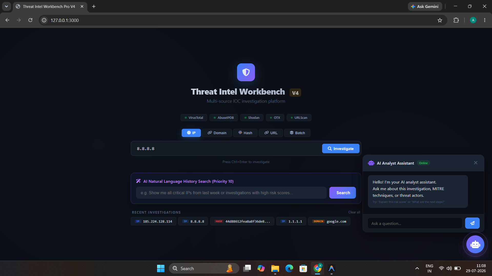
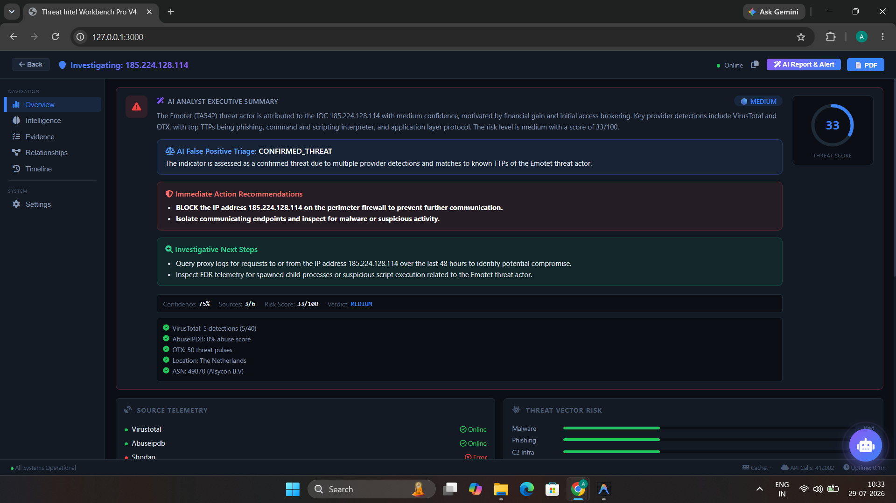
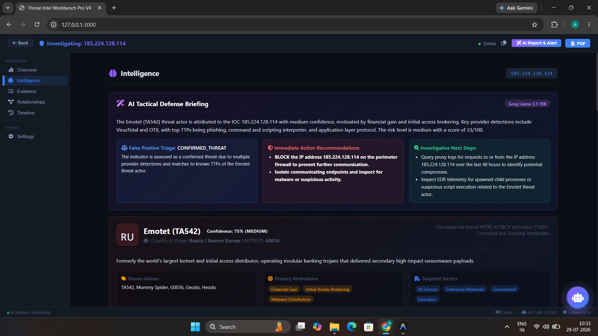
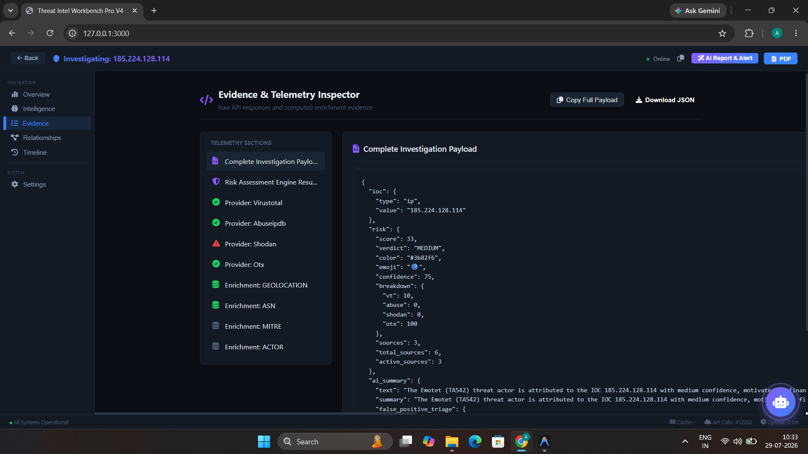
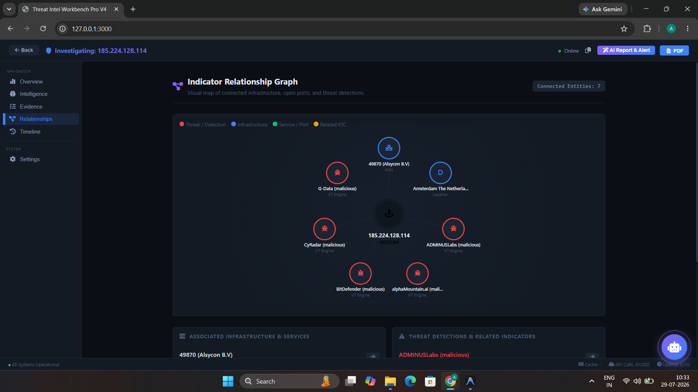
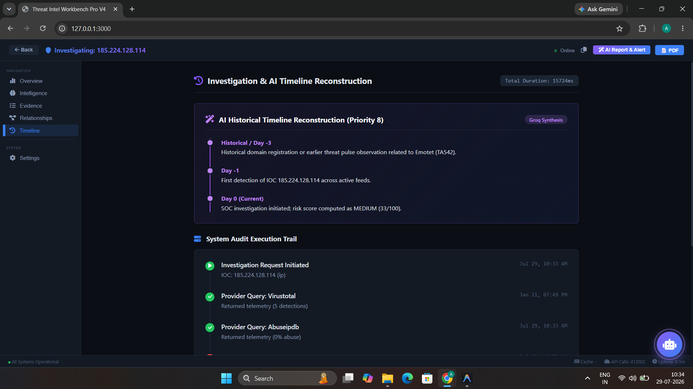

# 🛡️ Threat Intel Workbench Pro V4

[](https://github.com/arunchavan143/ThreatIntelWorkbench)
[](https://nodejs.org/)
[](https://expressjs.com/)
[](https://www.docker.com/)
[](https://attack.mitre.org/)
[](https://groq.com/)
[](https://postgresql.org/)

---

## Project Overview

**Threat Intel Workbench Pro V4** is a high-performance, multi-source Security Operations Center (SOC) investigation platform designed for cybersecurity analysts, incident responders, and threat hunters. It correlates real-time telemetry across **15+ integrated threat intelligence feeds**, maps observed behaviors to the **MITRE ATT&CK® STIX 2.1 framework**, attributes threat campaigns to known **Advanced Persistent Threat (APT) profiles**, and synthesizes natural-language executive briefings powered by **Groq AI with centralized model selection (default: `openai/gpt-oss-120b`)**.

With **Version 4.0**, the platform now features a robust **PostgreSQL** database backend for persistent historical storage and **Server-Sent Events (SSE)** for real-time progress streaming during large batch investigations.

### AI Model Configuration

The AI layer uses a centralized backend model registry in `src/services/groq.service.js`.

Supported models currently registered by the application:

| Model ID | Display Name | Provider | Status |
| :--- | :--- | :--- | :---: |
| `openai/gpt-oss-120b` | GPT-OSS 120B | Groq | ✅ |
| `openai/gpt-oss-20b` | GPT-OSS 20B | Groq | ✅ |
| `qwen/qwen3.8-27b` | Qwen 3.8 27B | Groq | ✅ |

The default model is:

```text
openai/gpt-oss-120b
```

It can be overridden through:

```env
GROQ_MODEL=openai/gpt-oss-120b
```

The backend validates client-supplied model IDs against the allowlist before sending requests to Groq. The Groq API key remains server-side and is never exposed to the frontend.


---

## Features

- **🌐 Multi-Source Indicator Investigation**: Seamlessly query IP addresses, domain names, file hashes (MD5/SHA1/SHA256), URLs, and batch indicator lists from a unified, high-contrast dark glassmorphism interface.
- **🐘 PostgreSQL Persistent Storage (New in V4)**: Robust relational database backend to automatically retain all historical investigation records for long-term trend analysis and instantaneous querying.
- **⚡ Real-Time SSE Progress Streaming (New in V4)**: Real-time Server-Sent Events (SSE) push live scanning progress directly to the UI for massive batch indicator investigations without timeout risks.
- **🧠 Full AI-Powered Intelligence Suite (Groq AI; default model: `openai/gpt-oss-120b`)**:
  - **AI Conversational Chat Assistant (`Priority 4`)**: Interactive floating chat widget allowing natural language questions ("Why is this score 75?", "Explain this MITRE technique", "What containment steps should we take?") backed by real-time investigation context and quick-chip prompts.
  - **AI Smart Report & Alert Generator (`Priority 5, 7 & 8`)**: One-click multi-format synthesis inside a glassmorphic modal: C-suite **Executive Summary**, exhaustive **Technical Report**, high-urgency **Slack/Email Alert Templates (`Priority 7`)**, and chronological **Incident Response Timelines (`Priority 8`)**. Includes instant "Copy to Clipboard" and Markdown download.
  - **AI Bulk IOC Analysis & Campaign Tracking (`Priority 6 & 9`)**: Pattern synthesis across batch indicators (`/api/investigate/batch`), ASN/infrastructure correlations, and APT campaign tracking card rendered directly at the top of batch investigations.
  - **AI Natural Language History Search (`Priority 10`)**: Conversational search across historical PostgreSQL investigations ("Show high risk domains", "Find IOCs with score > 70", "Show recent IP checks") accessible via `Ctrl+Enter` or button click right below the main search bar.
  - **Markdown Parsing & Smart Pruning (`parseMarkdown` & `sanitizeForAI`)**: Custom markdown rendering engine (`utils.js`) formatting numbered MITRE TTP cards (`[1]`, `[2]`), code blocks, and bold headings into structured glassmorphic boxes. Payload pruning (`sanitizeForAI`) reduces multi-hundred KB raw dumps down to concise summaries under `~1.5KB` alongside Express `10MB` body limits to ensure lightning-fast, error-free AI generation (`413 Request Entity Too Large` prevention).
- **🎯 MITRE ATT&CK® STIX 2.1 Mapping**: Correlates threat indicators and provider tags directly to documented MITRE tactics and techniques (`T1059`, `T1566`, `T1071`, `T1016`) with confidence badges and interactive mitigation guidance.
- **🕵️ Threat Actor Attribution Engine**: Cross-references IOCs against an O(1) indexed alias database (`700+ aliases`) of major APT groups (`APT29 Cozy Bear`, `Lazarus Group`, `Conti`, `APT28`, `Scattered Spider`, `LockBit`, `Sandworm`, `Emotet`) to expose origin countries, primary motivations, and targeted industries.
- **📊 6 Professional Analyst Tabs**:
  1. **Overview**: AI executive summary, quantitative risk ring (`0-100`), provider status cards, false-positive triage evaluation, immediate action recommendations, and WHOIS/ASN/Geolocation infrastructure data.
  2. **Intelligence**: APT actor profile header, MITRE technique grid cards, provider breakdown progress bars, harvested IOC tables, observed TTPs, and AlienVault OTX pulse reports.
  3. **Evidence**: Raw JSON payloads across every provider with one-click copy and download for audit preservation.
  4. **Relationships**: Interactive node network graph visualizing structural connections between domains, IPs, and hashes.
  5. **Timeline**: Chronological indicator history tracking initial observation dates, SSL certificate windows, and recent detections.
  6. **Settings**: Real-time API health checks, in-memory TTL cache management with instant purge, and rate limit tracking.
- **📑 Executive Briefing & Data Exports**: One-click generation of cleanly formatted PDF investigation reports, CSV indicator exports suitable for SIEM/SOAR ingestion, and raw JSON evidence bundles.
- **🧪 Robust Automated Testing Suite (`Jest` & `ESLint`)**: 32 comprehensive unit and integration tests across 6 test suites covering risk scoring math, validation middleware, API authentication, health status, and full AI feature endpoints.
- **🐳 Enterprise Containerization**: Multi-stage, lightweight Alpine Docker and Docker Compose setup for consistent local execution or production deployment.

---

## Useful Commands

| Command | Description |
| :--- | :--- |
| `npm run dev` | Start the local development server with auto-reloading (`nodemon`). |
| `npm start` | Start the production Node.js server (`node src/app.js`). |
| `npm test` | Run the complete Jest unit and integration testing suite (`tests/` - 32 tests across 6 suites). |
| `npm run lint` | Run ESLint across `src/` to verify code formatting and syntax cleanliness. |
| `npm run check` | Execute both ESLint validation and automated Jest tests (`npm run lint && npm test`). |
| `npm run migrate` | Apply database migrations to PostgreSQL |
| `npm run seed` | Seed database with initial data |

---

## Tech Stack

### Frontend
- **HTML5 & CSS3**: Custom Dark Glassmorphism CSS architecture with HSL design variables and responsive CSS Grid/Flex layouts.
- **JavaScript (ES6+)**: Modular, dependency-free vanilla single-page application (SPA) controller with optimized DOM interaction and custom markdown formatting (`parseMarkdown`), fully integrated with **Server-Sent Events (SSE)**.

### Backend
- **Runtime & Framework**: Node.js 22 LTS, Express.js 4 RESTful API Gateway (`10MB` body limits supported).
- **Database**: PostgreSQL with Sequelize ORM for scalable historical storage.
- **Security & Middleware**: Helmet (Security Headers), CORS, Express-Rate-Limit (`100 req/15min`), Joi Schema & Regex Input Validation (`validateIP`, `validateDomain`, `validateHash`, `validateURL`, `validateBatch`).
- **Caching**: Node-Cache in-memory Time-To-Live (TTL) store with automatic purge.

### Threat Intelligence APIs
- **VirusTotal API v3**: File detections, vendor categories, domain infrastructure, and passive DNS records.
- **AbuseIPDB API v2**: IP confidence scoring, abuse incident reports, and ISP ownership.
- **Shodan Host API**: Open network ports, service banners, operating systems, and CVE vulnerabilities.
- **AlienVault OTX API**: Threat pulses, adversary tags, MITRE IDs, and related indicator lists.
- **URLScan.io API**: DOM analysis, screenshot records, and phishing classifications.

### AI Components
- **Groq SDK**: Large Language Model API (`llama-3.3-70b-versatile`) with specialized SOC analyst prompt engineering for conversational chat (`Priority 4`), multi-format briefings (`Priority 5, 7, 8`), batch synthesis (`Priority 6 & 9`), and historical natural language search (`Priority 10`).

### Docker
- **Multi-stage Build**: Alpine Linux containerization separating dependency build stages from runtime deployment. `docker-compose` orchestrated alongside PostgreSQL.

---

## Architecture

Threat Intel Workbench Pro operates on a decoupled REST API gateway and modular presentation architecture. The backend leverages `Promise.allSettled()` to query upstream intelligence feeds concurrently, ensuring graceful degradation if individual feeds experience timeouts or rate limits. Normalized telemetry is processed through a quantitative risk calculator, correlated against MITRE STIX 2.1 and Threat Actor indices, and passed to Groq AI for briefing synthesis. All data is reliably persisted in PostgreSQL.

For a comprehensive technical dive including data flow sequence diagrams, database schemas, security controls, and component breakdowns, read our detailed architecture document:

👉 **[System Architecture Documentation (`docs/ARCHITECTURE.md`)](docs/ARCHITECTURE.md)**

---

## Application Preview

### Home & Search Dashboard


### Overview & AI Executive Briefing


### Threat Intelligence & Actor Attribution


### Evidence & Raw JSON Inspection


### Infrastructure Relationship Graph


### Historical Investigation Timeline


---

## Installation

### Prerequisites
- **Node.js**: v18.x or v22.x LTS
- **npm**: v9.x or higher
- **PostgreSQL**: Local instance or Docker required
- **Docker & Docker Compose** *(Optional for containerized run)*

### Option 1: Local Installation

1. **Clone the repository**:
   ```bash
   git clone https://github.com/arunchavan143/ThreatIntelWorkbench.git
   cd ThreatIntelWorkbench
   ```

2. **Install dependencies**:
   ```bash
   npm install
   ```

3. **Configure environment variables**:
   Copy the `.env.example` template to `.env` and insert your upstream API keys and Database connection:
   ```bash
   cp .env.example .env
   ```
   ```env
   PORT=3000
   NODE_ENV=development
   
   DB_HOST=localhost
   DB_PORT=5432
   DB_NAME=threat_intel
   DB_USER=your_user
   DB_PASSWORD=your_password

   GROQ_API_KEY=your_groq_api_key_here
   GROQ_MODEL=openai/gpt-oss-120b

   VIRUSTOTAL_API_KEY=your_virustotal_api_key_here
   ABUSEIPDB_API_KEY=your_abuseipdb_api_key_here
   SHODAN_API_KEY=your_shodan_api_key_here
   OTX_API_KEY=your_alienvault_otx_api_key_here
   URLSCAN_API_KEY=your_urlscan_api_key_here

   # Optional API authentication for protected /api routes
   WORKBENCH_API_KEY=
   ```

4. **Run Migrations**:
   ```bash
   npm run migrate
   ```

5. **Start the development server**:
   ```bash
   npm run dev
   ```

6. **Access the platform**:
   Open `http://localhost:3000` in your browser.

---

### Option 2: Docker Deployment

1. Ensure your `.env` file is present and populated in the root directory.
2. Build and launch using Docker Compose:
   ```bash
   docker-compose up --build -d
   ```
3. Check container logs:
   ```bash
   docker-compose logs -f app
   ```
4. Open `http://localhost:3000` in your browser.

To gracefully shut down the container:
```bash
docker-compose down
```

---

## Database Setup

Threat Intel Workbench Pro V4 natively uses PostgreSQL for persistent storage of investigations.

### Option 1: Using Docker (Recommended)

The included `docker-compose.yml` will start a PostgreSQL container automatically alongside the app:

The current Compose configuration uses:

| Setting | Value |
| :--- | :--- |
| Database | `threat_intel` |
| User | `threat_user` |
| Password | `threat_pass_2024` |
| Host Port | `5432` |
| Image | `postgres:15-alpine` |

```bash
# Start the database and application together
docker-compose up -d

# Verify database is running
docker-compose ps
```

### Option 2: Local PostgreSQL Installation

1. **Install PostgreSQL**:
   - **Ubuntu/Debian**: `sudo apt install postgresql postgresql-contrib`
   - **macOS**: `brew install postgresql`
   - **Windows**: Download from [postgresql.org](https://www.postgresql.org/download/windows/)

2. **Start PostgreSQL**:
   ```bash
   # Ubuntu/Debian
   sudo service postgresql start
   
   # macOS
   brew services start postgresql
   ```

3. **Create Database**:
   ```bash
   # Connect to PostgreSQL
   sudo -u postgres psql
   
   # Create database
   CREATE DATABASE threat_intel;
   
   # Create user (optional)
   CREATE USER your_user WITH PASSWORD 'your_password';
   GRANT ALL PRIVILEGES ON DATABASE threat_intel TO your_user;
   
   # Exit
   \q
   ```

4. **Run Migrations**:
   ```bash
   npm run migrate
   ```

5. **Verify Database**:
   ```bash
   # Connect and verify tables
   psql -d threat_intel -c "\dt"
   
   # Expected tables:
   # investigations
   # SequelizeMeta (migrations)
   ```

### Troubleshooting

| Issue | Solution |
|-------|----------|
| `Connection refused` | Ensure PostgreSQL is running |
| `Database does not exist` | Run `createdb threat_intel` |
| `Migration failed` | Check credentials in `.env` |
| `Permission denied` | Grant privileges to your user |

---
## Folder Structure

```text
threat-intel-workbench-backend/
├── Dockerfile
├── docker-compose.yml
├── .dockerignore
├── .env.example
├── package.json
├── README.md
├── docs/
│   ├── ARCHITECTURE.md
│   ├── API.md
│   ├── USER_GUIDE.md
│   └── screenshots/
├── frontend/                     # Client-side SPA presentation layer
│   ├── index.html
│   ├── css/
│   │   └── style.css
│   └── js/
│       ├── app.js                # Core application/search/history UI
│       ├── api.js                # Fetch-based API client + AI model state
│       ├── ui.js                 # UI rendering and status controls
│       ├── utils.js              # safeString, parseMarkdown, sanitizeForAI
│       ├── chat-widget.js        # Floating AI SOC Assistant
│       └── tabs/
│           ├── intelligence.js
│           ├── evidence.js
│           ├── relationships.js
│           └── export.js
├── src/                          # Node.js / Express backend layer
│   ├── app.js                    # Express setup, security middleware, routes
│   ├── config/
│   ├── models/
│   │   ├── index.js
│   │   └── investigation.js
│   ├── migrations/
│   ├── seeders/
│   ├── middleware/
│   │   ├── logger.js
│   │   ├── rate-limit.js
│   │   ├── auth.js
│   │   ├── error-handler.js
│   │   └── validator.js
│   ├── routes/
│   │   ├── health.routes.js
│   │   ├── ai.routes.js
│   │   ├── investigate.routes.js
│   │   ├── export.routes.js
│   │   └── history.routes.js
│   ├── services/
│   │   ├── actor.service.js
│   │   ├── mitre.service.js
│   │   ├── groq.service.js
│   │   ├── virustotal.service.js
│   │   ├── abuseipdb.service.js
│   │   ├── otx.service.js
│   │   ├── shodan.service.js
│   │   ├── urlscan.service.js
│   │   ├── geolocation.service.js
│   │   ├── asn.service.js
│   │   ├── whois.service.js
│   │   ├── dns.service.js
│   │   ├── ssl.service.js
│   │   ├── certificate-transparency.service.js
│   │   ├── subdomain.service.js
│   │   ├── logger.service.js
│   │   ├── cache.service.js
│   │   └── sse.service.js
│   └── utils/
│       └── risk-calculator.js
└── tests/
    ├── auth.test.js
    ├── health.test.js
    ├── investigate.test.js
    ├── risk-calculator.test.js
    ├── validator.test.js
    └── ai-features.test.js
```

---

## API Highlights

### Core Investigation Routes

```text
GET  /api/investigate/ip/:ip
GET  /api/investigate/domain/:domain
GET  /api/investigate/hash/:hash
GET  /api/investigate/url?url=...
POST /api/investigate/batch
POST /api/investigate/batch-stream
POST /api/investigate/chat
```

### AI Metadata Routes

```text
GET /api/ai/models
GET /api/ai/status
```

`/api/ai/models` returns the supported model allowlist and configured default. `/api/ai/status` reports Groq configuration status without exposing the API key.

### History Routes

```text
GET  /api/history
GET  /api/history/:id
POST /api/history/ai-search
```

### Export Routes

```text
POST /api/export/json
POST /api/export/csv
POST /api/export/ai-brief
```

### MITRE Sync

```text
POST /api/mitre/sync
```

### Health

```text
GET /health
```

---

## AI Request Flow

The AI architecture is centralized around `src/services/groq.service.js`.

```text
Frontend
   │
   ├── selected model ID
   ├── conversation messages
   └── investigation context
            │
            ▼
POST /api/investigate/chat
            │
            ▼
GroqService.validateModel()
            │
            ▼
Central model allowlist
            │
            ▼
Groq API
            │
            ▼
AI response
```

For model discovery:

```text
Frontend
   │
   ▼
GET /api/ai/models
   │
   ▼
Supported models + default
   │
   ▼
Validated local selection
```

The frontend stores the selected model ID in browser `localStorage` and sends it with chat requests. The backend remains authoritative and rejects unsupported model IDs.

---

## Security Architecture

The application includes several security controls:

- **Helmet** for HTTP security headers.
- **CORS** configuration through `CORS_ORIGIN`.
- **Express rate limiting** for `/api/` routes.
- **Joi/regex validation** for IOC input.
- **Optional API-key authentication** using `WORKBENCH_API_KEY` or `API_KEY`.
- **Server-side secret handling** for all external provider API keys.
- **Client-side AI model validation followed by backend allowlist validation**.
- **10 MB Express JSON/urlencoded request limits**.
- **Centralized error handling**.

### Protected Route Groups

When a workbench API key is configured:

```text
/api/investigate/*
/api/history/*
/api/export/*
/api/mitre/sync
```

The following AI metadata routes remain public because they expose configuration metadata only:

```text
/api/ai/models
/api/ai/status
```

### Secrets

Never commit:

```text
.env
```

Never expose:

```text
GROQ_API_KEY
VIRUSTOTAL_API_KEY
ABUSEIPDB_API_KEY
SHODAN_API_KEY
OTX_API_KEY
URLSCAN_API_KEY
WORKBENCH_API_KEY
```

inside frontend source code or public client payloads.

---

## AI Troubleshooting

### AI Assistant Shows an Error

Check the Groq configuration:

```bash
curl http://localhost:3000/api/ai/status
```

Then verify that `.env` contains:

```env
GROQ_API_KEY=your_real_groq_key
GROQ_MODEL=openai/gpt-oss-120b
```

Check the supported model registry:

```bash
curl http://localhost:3000/api/ai/models
```

The frontend chat assistant uses:

```text
POST /api/investigate/chat
```

with:

```json
{
  "messages": [
    {
      "role": "user",
      "content": "Why did this indicator receive this risk score?"
    }
  ],
  "context": {},
  "model": "openai/gpt-oss-120b"
}
```

Do not use the old `/api/chat` contract.

---

## Database Troubleshooting

If PostgreSQL is running but application tables are missing, run:

```bash
npm run migrate
```

For Docker:

```bash
docker-compose up -d db
docker-compose ps
npm run migrate
```

Check the configured database values in `.env` and confirm they match the active PostgreSQL instance.

Do not remove the `pgdata` Docker volume unless you intentionally want to discard the persisted PostgreSQL data.

---

## Documentation

- 📖 **[User Guide (`docs/USER_GUIDE.md`)](docs/USER_GUIDE.md)**: Operational manual covering investigation workflows, tab breakdowns, and export procedures.
- ⚙️ **[API Reference (`docs/API.md`)](docs/API.md)**: Complete REST API documentation including endpoint paths, parameters, JSON schemas, and Server-Sent Events (SSE).
- 🏗️ **[System Architecture (`docs/ARCHITECTURE.md`)](docs/ARCHITECTURE.md)**: Comprehensive technical specification detailing Mermaid flowcharts, PostgreSQL integration, SSE, multi-feed concurrency, and security defense layers.

---

## Current Implementation Notes

The repository currently uses:

```text
Runtime:       Node.js 22
Framework:     Express 4
Database:      PostgreSQL 15 via Docker Compose
ORM:           Sequelize
Frontend:      Vanilla JavaScript SPA
AI Provider:   Groq
Default AI:    openai/gpt-oss-120b
```

The AI model registry is centralized in:

```text
src/services/groq.service.js
```

The AI model API is exposed through:

```text
src/routes/ai.routes.js
```

The main AI chat route is:

```text
POST /api/investigate/chat
```

The floating frontend assistant is implemented in:

```text
frontend/js/chat-widget.js
```

The frontend AI model state is handled in:

```text
frontend/js/api.js
```

---

## Roadmap

- **Automated TAXII 2.1 Ingestion**: Add a background worker module to automatically ingest and index live STIX/TAXII 2.1 threat feeds from global CERTs.
- **Role-Based Access Control (RBAC)**: Support multi-tenant enterprise SOC teams by implementing JWT authentication and tiered analyst roles.
- **YARA Rule Engine**: Incorporate automated static analysis and dynamic YARA rule execution on uploaded batch samples.

---

## Author

Designed and engineered for professional SOC analysts and defensive cybersecurity engineers.
**Arun Chavan** (`@arunchavan143`)

## 📄 License

This project is licensed under the MIT License. See the [LICENSE](LICENSE) file for details.
