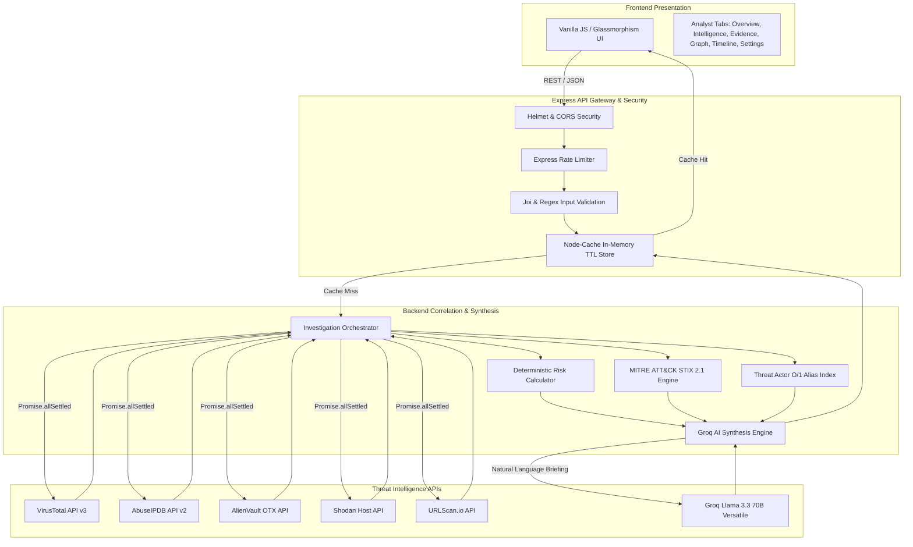
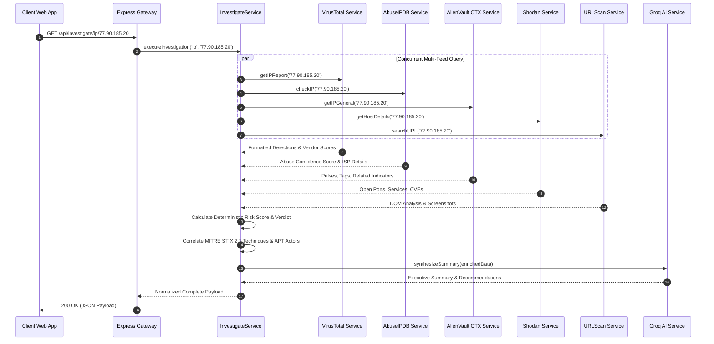
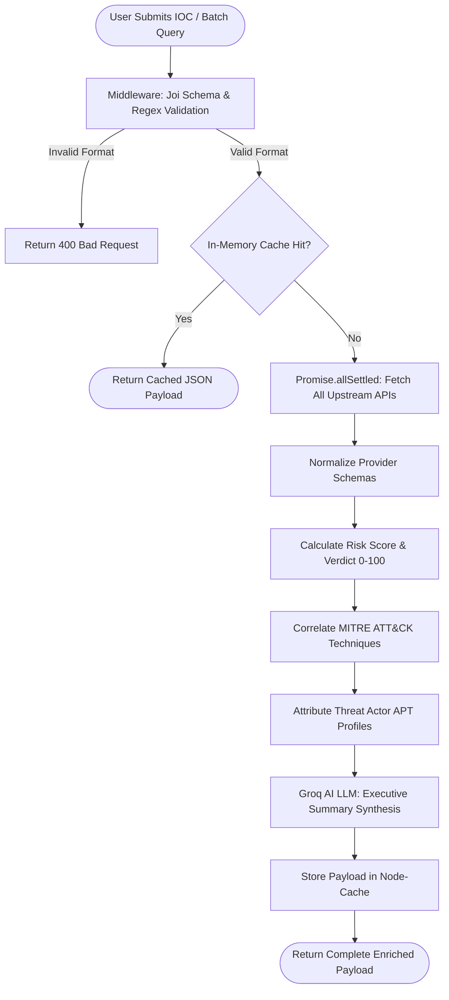

# System Architecture - Threat Intel Workbench Pro V3

This document details the software architecture, data flow pipelines, correlation engines, and security model of **Threat Intel Workbench Pro V3**.

---

## 🏗️ High-Level Architecture Diagram

Threat Intel Workbench Pro operates on a decoupled, modular, single-page application (SPA) and REST API gateway architecture designed for high-concurrency SOC environments.



---

## 🖥️ Frontend Architecture

The frontend is built using **pure HTML5, CSS3, and modern modular JavaScript (ES6+)** to maintain zero build-step overhead, instant page loads, and direct DOM performance.

- **Design System**: A custom Dark Glassmorphism CSS architecture (`style.css`) utilizing HSL color variables, backdrop blur filters, responsive CSS Grid layouts, and CSS transitions.
- **State Management**: Application state (`window.currentData`) is managed cleanly inside global application context, enabling real-time switching between investigation tabs without re-querying the backend.
- **Component Modules**:
  - `utils.js`: Safe string escaping (`safeString`), date normalization, formatting helpers, and UI toast notifications.
  - `api.js`: Axios-based HTTP client encapsulating GET/POST requests with error handling and retry logic.
  - `ui.js`: DOM controller managing indicator search chips, status badges, and loading states.
  - `tabs/intelligence.js`: Multi-source correlation renderer for Threat Actor profiles, MITRE ATT&CK grid cards, provider breakdown bars, harvested IOC tables, and AlienVault OTX pulse reports.
  - `tabs/evidence.js`: Raw JSON inspector with copy/download controls.
  - `tabs/relationships.js`: Interactive node network visualization depicting domain/IP/hash connections.
  - `tabs/export.js`: Client-side executive PDF briefing generator and CSV indicator exporter.

---

## ⚙️ Backend Architecture

The backend runs on **Node.js 22 LTS and Express.js 4**, structured around clear architectural boundaries: routes, middleware, business logic controllers, utilities, and external API services.

- **Asynchronous Concurrency**: The core investigation engine leverages `Promise.allSettled()` to fetch intelligence simultaneously across independent upstream APIs. This ensures **graceful degradation**—if an external feed is offline, rate-limited, or times out, the overall investigation completes successfully with the remaining provider data.
- **Caching Layer**: An in-memory cache (`node-cache`) with configurable Time-To-Live (TTL) stores normalized investigation payloads. Repeated queries to identical IOCs hit memory instantly, saving external API quota and returning results in under `5ms`.

---

## 🔌 Threat Intelligence & Provider Integration Flow

Each upstream provider is encapsulated inside its own dedicated service module inside `src/services/`, transforming disparate vendor JSON schemas into a unified, standardized internal data model.



### Provider Integration Breakdown

1. **VirusTotal (`virustotal.service.js`)**: Queries `/files/:id`, `/ip_addresses/:ip`, and `/domains/:domain` endpoints. Extracts vendor classification statistics (`malicious`, `suspicious`, `harmless`), category tags, and passive DNS records.
2. **AbuseIPDB (`abuseipdb.service.js`)**: Queries the `/check` API endpoint for IP indicators. Extracts `abuseConfidenceScore`, total report count, distinct reporting users, ISP/ASN ownership, and country of registration.
3. **AlienVault OTX (`otx.service.js`)**: Queries `/indicators/domain/:domain/general`, `/indicators/IPv4/:ip/general`, and `/indicators/file/:hash/general`. Recursively extracts pulse titles, author notes, malware families, adversary group tags, and deep indicator lists (`related_indicators`).
4. **Shodan (`shodan.service.js`)**: Queries `/shodan/host/:ip`. Extracts open network ports, service banners, operating system identifications, and known CVE vulnerabilities.
5. **URLScan (`urlscan.service.js`)**: Queries `/search/?q=domain/:domain` to inspect historical DOM scans, screenshot captures, and phishing classifications.

---

## 🤖 AI Risk Assessment & Correlation Pipeline

Once raw telemetry is harvested, the backend executes three critical analytical passes:

1. **Deterministic Risk Scoring (`risk-calculator.js`)**:
   Synthesizes quantitative metrics (e.g., VT detections / total engines, AbuseIPDB confidence score, OTX pulse count) into a unified risk score ranging from `0` to `100` along with a severity verdict (`CLEAN`, `LOW`, `MEDIUM`, `HIGH`, `CRITICAL`).
2. **MITRE ATT&CK® STIX 2.1 Mapping (`mitre.service.js`)**:
   Cross-references tags, behaviors, and malware signatures observed in OTX pulses and VirusTotal feeds against an internal STIX 2.1 database. Maps indicators directly to actionable techniques (e.g., `T1059 Command and Scripting Interpreter`, `T1566 Phishing`, `T1016 System Network Configuration Discovery`) along with confidence ratings and documented defensive mitigations.
3. **Threat Actor Attribution (`actor.service.js`)**:
   Uses an O(1) case-insensitive alias index (`aliasIndex`) covering over 700+ naming variations across 8+ major APT profiles (`APT29 Cozy Bear`, `Lazarus Group`, `Conti`, `APT28 Fancy Bear`, `Scattered Spider`, `LockBit`, `Sandworm`, `Emotet`). Identifies the primary actor, origin flag, primary motivations, and historical campaigns.
4. **Groq AI Synthesis (`groq.service.js`)**:
   Submits the correlated payload to the Groq LLM API (`llama-3.3-70b-versatile`) with a specialized SOC analyst system prompt. The LLM generates:
   - A concise executive briefing explaining what the indicator is and why it is flagged.
   - Consensus analysis across independent providers.
   - Actionable containment instructions tailored to the exact risk level.

---

## 🔄 IOC Processing Workflow & Data Flow Diagram



---

## 📂 Folder Architecture

```text
threat-intel-workbench-backend/
├── Dockerfile               # Multi-stage production Alpine build
├── docker-compose.yml       # Container orchestration & volume mapping
├── .dockerignore            # Build context exclusions
├── .env.example             # Template for API keys and configuration
├── package.json             # Project dependencies and script definitions
├── README.md                # Project overview and portfolio documentation
├── docs/
│   ├── ARCHITECTURE.md      # Detailed system architecture specification
│   ├── API.md               # REST API endpoints and payload examples
│   ├── USER_GUIDE.md        # Comprehensive analyst operational manual
│   └── screenshots/         # Embedded application previews
│       ├── home.png
│       ├── overview.png
│       ├── intelligence.png
│       ├── evidence.png
│       ├── relationship.png
│       └── timeline.png
├── frontend/                # Client-Side SPA Presentation Layer
│   ├── index.html           # Single-page application shell
│   ├── css/
│   │   └── style.css        # Dark glassmorphism theme and CSS Grid styles
│   └── js/
│       ├── app.js           # Core initialization and event binding
│       ├── api.js           # Axios HTTP client encapsulating backend routes
│       ├── ui.js            # UI DOM controllers and status indicators
│       ├── utils.js         # Security escaping (`safeString`) and helpers
│       └── tabs/
│           ├── intelligence.js  # Threat Actor, MITRE, Provider, and IOC UI renderer
│           ├── evidence.js      # Raw JSON inspector and clipboard utilities
│           ├── relationships.js # Interactive network visualization graph
│           └── export.js        # Executive PDF report and CSV generation
└── src/                     # Node.js / Express Backend Layer
    ├── app.js               # Express application setup and middleware setup
    ├── middleware/
    │   ├── error-handler.js # Centralized JSON error dispatcher
    │   └── validator.js     # Joi validation schemas and regular expressions
    ├── routes/
    │   ├── investigate.routes.js # /api/investigate endpoints (IP/Domain/Hash/URL/Batch)
    │   └── export.routes.js      # Export utility routes
    ├── services/
    │   ├── actor.service.js      # O(1) Threat Actor APT profile index & correlation
    │   ├── mitre.service.js      # MITRE ATT&CK STIX 2.1 mapping database
    │   ├── groq.service.js       # Groq AI LLM (`llama-3.3-70b-versatile`) integration
    │   ├── virustotal.service.js # VirusTotal API v3 integration
    │   ├── abuseipdb.service.js  # AbuseIPDB API v2 integration
    │   ├── otx.service.js        # AlienVault OTX indicator and pulse integration
    │   ├── shodan.service.js     # Shodan open port and banner integration
    │   ├── urlscan.service.js    # URLScan domain/url telemetry integration
    │   └── cache.service.js      # Node-Cache in-memory TTL controller
    └── utils/
        └── risk-calculator.js    # Quantitative risk scoring and verdict engine
```

---

## 🛡️ Security Considerations

Threat Intel Workbench Pro incorporates defense-in-depth security best practices at both the gateway and presentation layers:

1. **HTTP Security Headers (`helmet`)**:
   Enforces strict HTTP headers to protect against clickjacking, MIME-type sniffing, and protocol downgrade attacks.
2. **API Rate Limiting (`express-rate-limit`)**:
   Defends backend endpoints against denial-of-service (DoS) bursts and brute-force abuse by enforcing IP-based sliding window thresholds (`100 requests per 15 minutes` by default).
3. **Cross-Origin Resource Sharing (`cors`)**:
   Restricts API access to authorized origins and methods, preventing unauthorized third-party web clients from querying upstream keys.
4. **Input Sanitization & Regex Validation (`joi`)**:
   All incoming indicator strings undergo rigorous validation before any network call occurs. Invalid strings, SQL injection attempts, or malformed paths are rejected immediately at the gateway (`400 Bad Request`).
5. **Cross-Site Scripting (XSS) Prevention (`safeString`)**:
   Every string rendered inside dynamic frontend HTML templates (`intelligence.js`, `relationships.js`, etc.) passes through `safeString(str)` to escape HTML entities (`&`, `<`, `>`, `"`, `'`).
6. **Environment Isolation (`dotenv`)**:
   API keys for upstream providers are stored exclusively in server-side `.env` configuration files and are never exposed to client-side bundles or network responses.

---

## 🗺️ Future Architecture Roadmap

- **Persistent SIEM / Database Storage**: Transition historical investigation records from in-memory cache to a persistent PostgreSQL or SQLite database for long-term audit retention and trend analysis.
- **WebSocket / Server-Sent Events (SSE)**: Implement real-time progress streaming for large batch queries (`/api/investigate/batch`), pushing incremental indicator results to the UI as each provider completes.
- **TAXII 2.1 Feed Ingestion Engine**: Add a native background worker to continuously ingest automated STIX/TAXII 2.1 threat feeds from CERTs and industry sharing groups.
- **Multi-Tenant Role-Based Access Control (RBAC)**: Introduce JWT or OAuth2 authentication with granular role assignments (`Analyst`, `Senior Analyst`, `Admin`) to support enterprise SOC team workflows.
