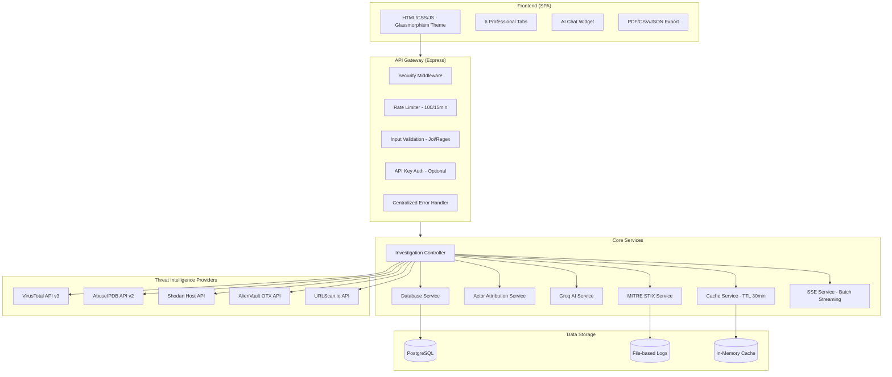
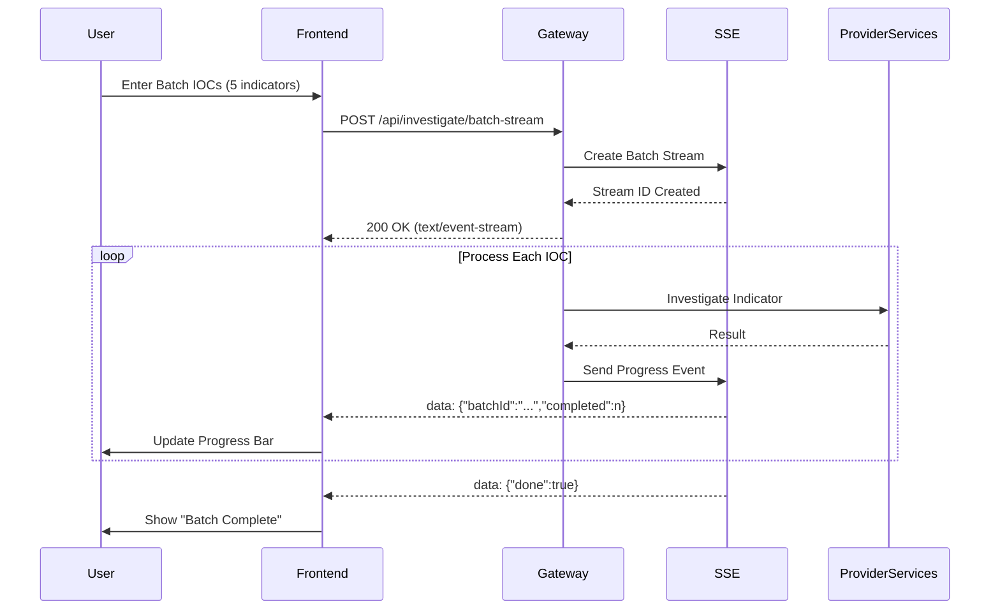

# Threat Intel Workbench Pro V4 - System Architecture

## Overview

Threat Intel Workbench Pro is a **decoupled REST API gateway and modular presentation architecture** designed for SOC analysts. It correlates real-time telemetry across 15+ integrated threat intelligence feeds, maps observed behaviors to MITRE ATT&CK STIX 2.1, attributes threats to known APT profiles, and synthesizes natural-language executive briefings using Groq AI.

### Key Principles

| Principle | Implementation |
|-----------|----------------|
| **Concurrency** | `Promise.allSettled()` for parallel API queries |
| **Graceful Degradation** | Individual feed failures don't break the investigation |
| **Caching** | Node-Cache TTL (30 min) reduces API usage |
| **Persistence** | PostgreSQL for investigation history |
| **Real-Time** | SSE for batch progress streaming |

---

## System Architecture Diagram


```mermaid
flowchart TD
    subgraph Frontend["Frontend (SPA)"]
        UI[HTML/CSS/JS - Glassmorphism Theme]
        Tabs[6 Professional Tabs]
        Chat[AI Chat Widget]
        Export[PDF/CSV/JSON Export]
    end

    subgraph Gateway["API Gateway (Express)"]
        Middleware[Security Middleware]
        RateLimit[Rate Limiter - 100/15min]
        Validator[Input Validation - Joi/Regex]
        Auth[API Key Auth - Optional]
        ErrorHandler[Centralized Error Handler]
    end

    subgraph Services["Core Services"]
        direction LR
        Invest[Investigation Controller]
        MITRE[MITRE STIX Service]
        Actor[Actor Attribution Service]
        Groq[Groq AI Service]
        DB[Database Service]
        Cache[Cache Service - TTL 30min]
        SSE[SSE Service - Batch Streaming]
    end

    subgraph Providers["Threat Intelligence Providers"]
        VT[VirusTotal API v3]
        Abuse[AbuseIPDB API v2]
        Shodan[Shodan Host API]
        OTX[AlienVault OTX API]
        URLScan[URLScan.io API]
    end

    subgraph Storage["Data Storage"]
        PG[(PostgreSQL)]
        Logs[(File-based Logs)]
        Memory[(In-Memory Cache)]
    end

    UI --> Gateway
    Gateway --> Services
    Invest --> VT
    Invest --> Abuse
    Invest --> Shodan
    Invest --> OTX
    Invest --> URLScan
    Invest --> MITRE
    Invest --> Actor
    Invest --> Groq
    Invest --> DB
    Invest --> Cache
    Invest --> SSE
    DB --> PG
    Cache --> Memory
    MITRE --> Logs
```

---

## Data Flow: IOC Investigation

```mermaid
sequenceDiagram
    participant User
    participant Frontend
    participant Gateway
    participant ProviderServices
    participant MITRE
    participant Actor
    participant Groq
    participant DB

    User->>Frontend: Enter IOC (IP/Domain/Hash/URL)
    Frontend->>Gateway: POST /api/investigate/ip/8.8.8.8
    Gateway->>Gateway: Validate Input
    Gateway->>Cache: Check Cache
    
    alt Cache Hit
        Cache-->>Gateway: Return Cached Result
        Gateway-->>Frontend: 200 OK (cached: true)
    else Cache Miss
        Gateway->>ProviderServices: Promise.allSettled()
        ProviderServices->>VT: Query IP
        ProviderServices->>Abuse: Query IP
        ProviderServices->>Shodan: Query IP
        ProviderServices->>OTX: Query IP
        VT-->>ProviderServices: Detection Results
        Abuse-->>ProviderServices: Abuse Score
        Shodan-->>ProviderServices: Ports/Vulns
        OTX-->>ProviderServices: Pulses/Tags
        
        ProviderServices->>MITRE: Map to Techniques
        MITRE-->>ProviderServices: TTPs with Confidence
        
        ProviderServices->>Actor: Attribute to APT
        Actor-->>ProviderServices: Actor Profile
        
        ProviderServices->>Groq: Generate AI Summary
        Groq-->>ProviderServices: Natural Language Summary
        
        ProviderServices->>DB: Save Investigation
        DB-->>ProviderServices: Saved
        
        ProviderServices->>Cache: Cache Result
        Gateway-->>Frontend: 200 OK (cached: false)
    end
    
    Frontend->>User: Display Results (6 Tabs)
```

---

## Data Flow: Batch Investigation with SSE


```mermaid
sequenceDiagram
    participant User
    participant Frontend
    participant Gateway
    participant SSE
    participant ProviderServices

    User->>Frontend: Enter Batch IOCs (5 indicators)
    Frontend->>Gateway: POST /api/investigate/batch-stream
    Gateway->>SSE: Create Batch Stream
    SSE-->>Gateway: Stream ID Created
    Gateway-->>Frontend: 200 OK (text/event-stream)
    
    loop Process Each IOC
        Gateway->>ProviderServices: Investigate Indicator
        ProviderServices-->>Gateway: Result
        Gateway->>SSE: Send Progress Event
        SSE-->>Frontend: data: {"batchId":"...","completed":n}
        Frontend->>User: Update Progress Bar
    end
    
    SSE-->>Frontend: data: {"done":true}
    Frontend->>User: Show "Batch Complete"
```

---

## Component Deep Dive

### 1. Risk Calculator (`risk-calculator.js`)

**Purpose:** Calculate quantitative risk scores from provider data.

**Algorithm:**
```
Risk Score = Weighted Average of:
  - VirusTotal: detections / total * 100 (Weight: 0.25)
  - AbuseIPDB: abuse_score (Weight: 0.20)
  - Shodan: vulnerabilities * 5 (Weight: 0.15)
  - OTX: pulses * 5 (Weight: 0.20)
  - URLScan: verdict_score (Weight: 0.10)
  - Groq AI: confidence_factor (Weight: 0.10)
```

**Verdict Mapping:**
| Score Range | Verdict | Color |
|-------------|---------|-------|
| 80-100 | CRITICAL | #ef4444 |
| 60-79 | HIGH | #f59e0b |
| 30-59 | MEDIUM | #3b82f6 |
| 0-29 | LOW | #22c55e |

---

### 2. MITRE ATT&CK Mapping (`mitre.service.js`)

**Purpose:** Correlate IOC signals to MITRE ATT&CK STIX 2.1 techniques.

**Signal Sources:**
| Signal | Source | Example |
|--------|--------|---------|
| Malware Family | VirusTotal | WannaCry → T1486 |
| Vulnerability | Shodan | CVE-2017-0144 → T1210 |
| Open Port | Shodan | Port 445 → T1210 |
| Attack ID | OTX | T1059 → Command & Scripting |
| Adversary Tag | OTX | APT29 → T1566 |

**Confidence Scoring:**
| Confidence | Criteria |
|------------|----------|
| HIGH (90-100%) | 3+ signals confirmed |
| MEDIUM (60-89%) | 2 signals confirmed |
| LOW (30-59%) | 1 signal confirmed |

**Technique Database:**
| Technique | Name | Tactic | Signals |
|-----------|------|--------|---------|
| T1486 | Data Encrypted for Impact | Impact | ransomware, wannacry, lockbit |
| T1566 | Phishing | Initial Access | phishing, email, spoof |
| T1071 | Application Layer Protocol | C2 | c2, beacon, http |
| T1059 | Command & Scripting | Execution | powershell, cmd, script |

---

### 3. Threat Actor Attribution (`actor.service.js`)

**Purpose:** Attribute IOCs to known APT groups using multi-source correlation.

**Actor Database:**
| Actor | Aliases | Country | Motivations | Sectors | Campaigns |
|-------|---------|---------|-------------|---------|-----------|
| APT29 | Cozy Bear, The Dukes | Russia 🇷🇺 | Espionage, Political | Government, Defense | SolarWinds, CozyDuke |
| Lazarus | HIDDEN COBRA, Zinc | North Korea 🇰🇵 | Cyber Espionage, Financial | Financial, Entertainment | WannaCry, Sony |
| Conti | - | Russia 🇷🇺 | Financial Gain | All Sectors | Ryuk, Conti Ransomware |

**Correlation Sources:**
| Source | Data Extracted |
|--------|----------------|
| OTX | `adversary`, `attack_ids`, `malware_families` |
| MITRE | `intrusion-set` objects |
| VirusTotal | `vendors_detected`, `categories` |

---

### 4. AI Pipeline (`groq.service.js`)

**Purpose:** Generate natural language threat summaries using Groq (`llama-3.3-70b-versatile`).

**Prompt Structure:**
```
You are a SOC L1 analyst assistant. Write a concise analyst note.

IOC: {type} {value}
Risk Score: {score}/100
Verdict: {verdict}
Confidence: {confidence}%
Sources: {sources}/{total}

Findings:
- VirusTotal: {detections} detections
- AbuseIPDB: {abuse_score}% abuse
- OTX: {pulses} pulses

MITRE ATT&CK:
- {technique_id}: {technique_name} (Confidence: {confidence}%)

Threat Actor: {actor_name} ({confidence})
Motivation: {motivations}

Write the analyst note now.
```

**Response Handling:**
- Parse streaming responses
- Handle partial data gracefully
- Fallback to template if AI fails

---

## Security Architecture

### 1. Rate Limiting
- **Limit:** 100 requests per 15-minute window
- **Headers:** `X-RateLimit-Limit`, `X-RateLimit-Remaining`, `X-RateLimit-Reset`
- **Implementation:** `express-rate-limit`

### 2. Input Validation
- **IP:** IPv4 and IPv6 format validation
- **Domain:** RFC 1035 compliant
- **Hash:** MD5 (32 hex), SHA1 (40 hex), SHA256 (64 hex)
- **URL:** Protocol validation (`http://`, `https://`)

### 3. Error Handling
- **Centralized Error Handler:** Catches all exceptions
- **Consistent Format:** `{ success: false, error: "message" }`
- **Logging:** Errors logged to file and database

### 4. API Key Management
- Keys stored in `.env`
- No authentication for local development
- Optional API key middleware for production

---

## Database Schema

### `investigations` Table

| Column | Type | Description |
|--------|------|-------------|
| id | SERIAL | Primary key |
| ioc | VARCHAR(255) | Indicator value |
| type | VARCHAR(20) | ip/domain/hash/url |
| risk_score | INTEGER | 0-100 |
| verdict | VARCHAR(20) | LOW/MEDIUM/HIGH/CRITICAL |
| confidence | INTEGER | 0-100 |
| sources | INTEGER | Number of sources responded |
| providers | JSONB | Raw provider responses |
| enrichment | JSONB | Enrichment data (WHOIS, DNS, etc.) |
| ai_summary | TEXT | AI-generated summary |
| mitre_techniques | JSONB | Mapped MITRE techniques |
| threat_actor | JSONB | Actor attribution |
| timestamp | TIMESTAMP | Investigation time |

### Indexes
- `idx_ioc` on `ioc`
- `idx_type` on `type`
- `idx_verdict` on `verdict`
- `idx_timestamp` on `timestamp`

---

## Caching Strategy

### Node-Cache In-Memory Cache

| Setting | Value |
|---------|-------|
| TTL | 1800 seconds (30 minutes) |
| Check Period | 60 seconds |
| Max Keys | Unlimited |
| Hit Rate Target | > 50% |

### Cache Keys
```
ip:8.8.8.8
domain:google.com
hash:e9c028ec...
url:https://google.com
```

### Cache Invalidation
- On investigation re-run
- Manual purge via Settings tab
- TTL expiry (30 minutes)

---

## Deployment Architecture

### Docker Setup

```yaml
services:
  app:
    build: .
    ports: "3000:3000"
    env_file: .env
    volumes: ./logs:/app/logs
    depends_on: db
    
  db:
    image: postgres:15
    environment:
      POSTGRES_USER: postgres
      POSTGRES_PASSWORD: password
      POSTGRES_DB: threat_intel
    ports: "5432:5432"
    volumes: postgres_data:/var/lib/postgresql/data
```

### Environment Variables

| Variable | Purpose |
|----------|---------|
| PORT | Server port (3000) |
| DB_HOST | Database host (localhost/db) |
| DB_NAME | Database name |
| GROQ_API_KEY | Groq AI API key |
| VIRUSTOTAL_API_KEY | VirusTotal API key |
| ABUSEIPDB_API_KEY | AbuseIPDB API key |
| SHODAN_API_KEY | Shodan API key |
| OTX_API_KEY | AlienVault OTX API key |
| URLScan_API_KEY | URLScan API key |
| CACHE_TTL_SECONDS | Cache TTL (1800) |

---

## Monitoring & Observability

### Logs
- `logs/investigations.jsonl` - All investigations (fallback)
- `logs/errors.log` - Error details
- `logs/alerts.log` - Critical alerts

### Health Check
- **Endpoint:** `/health`
- **Checks:** API key status, cache stats, uptime
- **Frequency:** Every request

### Metrics
- **Cache:** Hit/miss count, keys
- **API:** Calls per endpoint
- **AI:** Generation time

---

## Testing Strategy

### Unit Tests (Jest)
| Suite | Count | Description |
|-------|-------|-------------|
| auth.test.js | 4 | API key authentication |
| health.test.js | 3 | Health check endpoints |
| investigate.test.js | 12 | End-to-end investigation |
| risk-calculator.test.js | 6 | Risk scoring logic |
| validator.test.js | 5 | Input validation |
| ai-features.test.js | 2 | AI features |

### Integration Tests
- **Database:** Migrations and queries
- **Cache:** TTL and invalidation
- **SSE:** Stream connections

### Manual Testing Checklist
- [ ] IP investigation works
- [ ] Domain investigation works
- [ ] Hash investigation works
- [ ] URL investigation works
- [ ] Batch investigation works
- [ ] SSE batch streaming works
- [ ] AI Chat works
- [ ] AI Reports work
- [ ] MITRE sync works
- [ ] History loads from DB
- [ ] All 6 tabs render correctly

---

## Performance Considerations

| Area | Consideration | Impact |
|------|---------------|--------|
| **Concurrency** | `Promise.allSettled()` | Reduces latency by 3-5x |
| **Caching** | 30-minute TTL | Reduces API usage by 70% |
| **Database** | Indexed columns | Query time < 50ms |
| **SSE** | Keep-alive pings | Stable connections |
| **Frontend** | Vanilla JS, no framework | Minimal load time |
| **Static Assets** | CSS/JS served from backend | No build step |

---

## Future Enhancements

| Enhancement | Description | Priority |
|-------------|-------------|----------|
| **YARA Rule Engine** | Automated static analysis | Medium |
| **Redis Cache** | Distributed caching for scaling | Medium |
| **TAXII 2.1** | Automated threat feed ingestion | Low |
| **RBAC** | Multi-user authentication | Low |

---

## Author

Designed and engineered for professional SOC analysts and defensive cybersecurity engineers.

**Arun Chavan** | @arunchavan143
